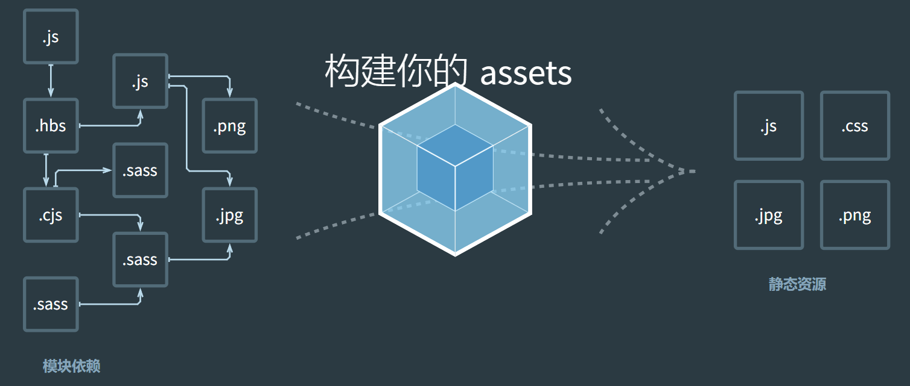

# 关于 Webpack

[Webpack 中文文档](https://webpack.docschina.org/)

## 什么是 Webpack

**Webpack 官网的介绍**

> 本质上，**webpack** 是一个用于现代 JavaScript 应用程序的 静态模块打包工具。当 webpack 处理应用程序时，它会在内部从一个或多个入口点构建一个 依赖图(dependency graph)，然后将你项目中所需的每一个模块组合成一个或多个 bundles，它们均为静态资源，用于展示你的内容。

**Webpack 的作用**

简单来说 Webpack 就是将你项目中的模块进行打包，然后生成一个或多个用于浏览器使用静态资源。

## 为什么使用 Webpack

### 1. 模块打包

Webpack 的核心功能是模块打包。它允许开发者将项目中的所有依赖项（JavaScript、CSS、图片等）打包成一个或多个 bundle。这使得代码更加模块化，易于维护和扩展。

### 2. 代码分割

Webpack 支持代码分割（Code Splitting），可以将代码拆分成多个 bundle，只在需要时加载。这对于提高大型应用的加载速度和性能至关重要。

### 3. 模块热替换（HMR）

Webpack 支持模块热替换（Hot Module Replacement），允许在开发过程中实时更新应用，而无需刷新页面。这大大提高了开发效率。

### 4. 丰富的加载器和插件生态系统

Webpack 拥有一个庞大的加载器（loaders）和插件（plugins）生态系统，可以处理各种类型的文件，并扩展 Webpack 的功能。例如，可以将 SCSS 文件编译成 CSS，将图片转换为 Base64 编码，或者进行代码压缩和优化。

### 5. 开发和生产环境配置

Webpack 允许为开发和生产环境配置不同的设置。例如，可以在开发环境中启用源映射（source maps）以便于调试，而在生产环境中启用压缩和优化插件以提高性能。

### 6. 多入口点和多输出文件

Webpack 支持配置多个入口点和输出文件，这对于构建大型应用或库非常有用。

### 7. 优化和压缩

Webpack 通过各种插件支持代码优化和压缩，如 UglifyJSPlugin 用于 JavaScript 代码压缩，TerserWebpackPlugin 用于 ES6+代码压缩。

### 8. 跨平台兼容性

Webpack 生成的 bundle 可以在各种环境中运行，包括浏览器和 Node.js，这为跨平台应用开发提供了便利。

### 9. 社区和文档支持

Webpack 拥有一个活跃的社区和丰富的文档，这意味着开发者可以轻松找到解决方案和最佳实践。

### 10. 集成和扩展性

Webpack 可以轻松集成到现有的构建流程中，并且可以与其他工具（如 Babel、PostCSS 等）配合使用，以实现更复杂的构建流程。

### 11. 性能监控

Webpack 提供了性能监控工具，如`webpack-bundle-analyzer`，可以帮助开发者识别和解决性能瓶颈。
